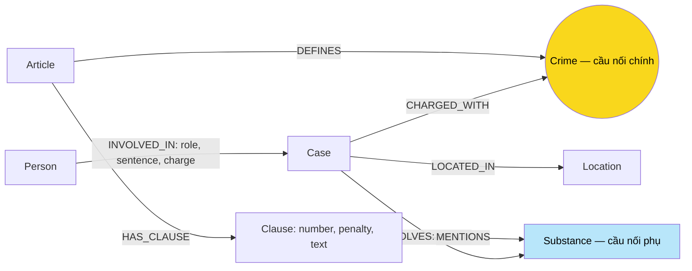

# Thiết kế Ontology — Day 19

**Họ tên:** Ngô Đình Minh Nhật  **MSSV:** 2A202602569

**Lựa chọn:**

- [x] Dùng ontology gợi ý (có thể chỉnh nhỏ)
- [ ] Tự thiết kế (xét bonus +15, xem `SUBMISSION.md`)

Bản thiết kế được lập trước khi code và đã cập nhật sau triển khai KG-1/KG-2. Schema khớp các hàm HINT trong `src/graph.py`, có bổ sung doc_id lúc tạo node dùng chung. Graph nhỏ, KG-3/KG-4 và benchmark đầy đủ (`--judge`, 207 node / 383 cạnh) đã chạy; kết quả và lỗi phân tích ở `REPORT_KG.md`. Chọn hướng chuẩn, tái sử dụng HINT và ghi rõ giới hạn của từng competency question.

### Tài liệu và dữ liệu đã đối chiếu

- `README.md`, `LAB_GUIDE.md`, `SUBMISSION.md`, template `report/REPORT_KG.md`.
- `src/graph.py`, `tests/test_graph.py`, phần `check()` của `bench_kg.py`.
- [Điều 251](../data/drug_law/blhs-dieu-251.md); đọc thêm [Điều 2 PCMT](../data/drug_law/pcmt-dieu-2.md), [Điều 250](../data/drug_law/blhs-dieu-250.md), [Điều 255](../data/drug_law/blhs-dieu-255.md) cho Q1, Q4, Q5.
- Bốn bài tin: [vụ hơn 36kg](../data/drug_news/news-100260928173914514.md), [Lê Minh Thành](../data/drug_news/news-100260918080821054.md), [Hoàng Nato](../data/drug_news/news-100260920221957595.md), [Cái Quang Huy](../data/drug_news/news-100260917203001265.md).
- Đọc thêm đoạn thu giữ MDMA trong [vụ Viện Pháp y tâm thần](../data/drug_news/news-100260924105118645.md), tìm MDMA trên toàn bộ KB tin và đối chiếu [benchmark_kg.json](../data/benchmark_kg.json).

Các nội dung luật sau đây được hiểu theo **phiên bản corpus**: BLHS 2015 sửa đổi 2017 và Luật PCMT 2021, không phải xác nhận luật hiện hành.

### Những thứ và quan hệ xuất hiện trong hai KB

**★** = xuất hiện trong cả hai KB về nội dung, không nhất thiết đều là node.

| Thứ / quan hệ | KB luật | KB tin | Biểu diễn |
| --- | --- | --- | --- |
| ★ Tội danh / hành vi | Tiêu đề Điều định nghĩa tội | Người bị cáo buộc hoặc tuyên án về tội | `Crime`; `Article → DEFINES → Crime`, `Case → CHARGED_WITH → Crime` |
| ★ Chất ma túy | MDMA, Heroine, Methamphetamine… | MDMA, ketamine, etomidate… trong tang vật | `Substance`; khoản `MENTIONS` chất, vụ `INVOLVES` chất |
| ★ Khối lượng và đơn vị | Ngưỡng 5, 30, 100 gam… | Hơn 9,6kg MDMA; khoảng 406g Ketamine; 5 viên MDMA | Ngưỡng trong `Clause.text`, lượng thực tế trong `INVOLVES.amount` |
| ★ Hình phạt | Khung tù, chung thân, tử hình, phạt tiền | Mức án cụ thể: 36 tháng, tử hình… | Phân biệt `Clause.penalty` với `INVOLVED_IN.sentence` |
| ★ Vai trò / tình tiết | Có tổ chức, tái phạm… | Cầm đầu, đồng phạm giúp sức… | `Clause.text`, `Case.summary`, `INVOLVED_IN.role` |
| Điều, khoản, điểm; Điều chứa khoản | Cấu trúc đánh số | Có thể được dẫn chiếu | Node `Article`, `Clause`; điểm giữ trong text |
| Khái niệm và định nghĩa | Tiền chất ở khoản 4 Điều 2 PCMT | Không phải trọng tâm bốn bài | `Clause.text`, không thêm node khái niệm |
| Người cụ thể, biệt danh; người tham gia vụ | Chỉ mô tả người nói chung | Dương Minh Tuấn = Hoàng Nato; Trần Thanh Tuấn… | `Person`, `aliases`, `INVOLVED_IN` |
| Vụ, nơi, ngày; vụ xảy ra tại nơi | Không có các vụ cụ thể trong tin | TP.HCM, Hà Nội, Nội Bài, Berlin; ngày bắt/xét xử | `Case`, `Location`, `LOCATED_IN`, property ngày |
| Cơ quan, giai đoạn tố tụng | Quy định chung | Công an, viện kiểm sát, tòa; bắt, truy tố, sơ/phúc thẩm | Giữ trong tóm tắt và nguồn, chưa thêm label |

## 1. Sơ đồ



## 2. Entity types (node labels)

| Label | Ý nghĩa | Khóa định danh (`MERGE` theo) | Properties | Lấy từ KB nào | Trích bằng (regex / LLM / khác) |
| --- | --- | --- | --- | --- | --- |
| `Article` | Một Điều | `id`: số Điều + luật, ví dụ `Điều 251 BLHS` | `id, title, law, doc_id` | Luật | Metadata + `parse_law_article` |
| `Clause` | Một khoản | `id`: Article.id + ` khoản ` + số khoản | `id, number` (integer), `penalty, text, doc_id` | Luật | Regex `CLAUSE_START`, tách tới khoản kế tiếp; regex hình phạt |
| `Crime` | Tội danh chuẩn | `name` sau `normalize_crime` | `name, doc_id` | Luật tạo danh mục, tin liên kết | Tiêu đề luật bắt đầu `Tội `; tin qua LLM rồi `link_entity` |
| `Case` | Vụ việc trong tin | `name` theo HINT | `name, summary, date, doc_id, source_title` | Tin | LLM `extract_news_cases` |
| `Person` | Người tham gia vụ | `name` đầy đủ theo HINT | `name, aliases` (list), `doc_id` | Tin | LLM, giải quyết tên rút gọn/biệt danh trong bài |
| `Substance` | Chất hoặc nhóm chất | `name`, ưu tiên danh sách chuẩn | `name, doc_id` | **Cả hai ★** | Luật: `find_substances` dò chuỗi không phân biệt hoa thường; tin: LLM |
| `Location` | Địa điểm của vụ | `name` theo HINT | `name, doc_id` | Tin | LLM, ưu tiên tên tỉnh/thành thống nhất |

`find_substances` hiện dùng dò chuỗi, không phải regex nhận diện hóa chất tổng quát. Không tự gán “kẹo”, “thuốc lắc” thành MDMA nếu bài chưa xác nhận; vụ Thành có kết luận giám định nên đủ căn cứ.

**Chống trùng:** gọi `suggested_constraints()` tạo unique constraint cho khóa của cả 7 label; nạp bằng `MERGE` cùng khóa. Article.id chứa cả tên luật, Clause.id chứa cả Điều nên không nhầm hai khoản cùng số. Tội danh phải được liên kết về danh mục luật trước khi ghi. Với người, chất, địa điểm, yêu cầu LLM dùng cùng cách viết đầy đủ trong prompt.

Constraint chỉ ngăn trùng **cùng khóa**. `Case.name` do LLM đặt vẫn có thể tách một vụ thành nhiều node; `Person.name` có thể nhập nhầm người đồng tên. Giữ khóa HINT để triển khai hướng chuẩn, chấp nhận giới hạn này thay vì tuyên bố đã giải quyết định danh xuyên bài. Khóa tốt hơn trong tương lai là ID hồ sơ hoặc ID nội bộ kèm bằng chứng hợp nhất, không chỉ đổi tên property.

**Nguồn:** triển khai KG-2 đặt `doc_id = Document.id` trên `Article`, `Clause`, `Case`. Với `Crime`, `Substance`, `Person`, `Location`, bổ sung `ON CREATE SET doc_id`: đây là tài liệu đầu tiên tạo node, không phải danh sách tất cả nguồn. Những nguồn khác được truy qua Article/Clause/Case liên quan; không ghi đè nguồn đầu tiên khi MERGE node dùng chung. `elementId()` chỉ dùng trong truy vấn, không phải khóa nghiệp vụ bền vững.

## 3. Relationships

| Type | Từ → Đến | Properties trên cạnh | Ý nghĩa |
| --- | --- | --- | --- |
| `INVOLVED_IN` | `Person → Case` | `role, sentence, charge` | Vai trò, mức án nếu có và tội danh **của người đó** trong vụ |
| `CHARGED_WITH` | `Case → Crime` | Không | Vụ liên quan tội danh theo tin, không chứng minh mọi người trong vụ đều phạm tội đó |
| `INVOLVES` | `Case → Substance` | `amount` (chuỗi) | Lượng được mô tả; giữ cả “hơn”, “gần” và đơn vị |
| `LOCATED_IN` | `Case → Location` | Không | Địa điểm của vụ |
| `DEFINES` | `Article → Crime` | Không | Điều BLHS định nghĩa tội; Điều giải thích từ ngữ PCMT không tạo Crime |
| `HAS_CLAUSE` | `Article → Clause` | Không | Khoản thuộc Điều |
| `MENTIONS` | `Clause → Substance` | Không | Khoản nhắc chất, **không có nghĩa** vụ đã thỏa điều kiện áp dụng khoản |

Cạnh được MERGE theo type và hai đầu node như HINT. Một cặp người–vụ chỉ giữ một bộ thuộc tính, một cặp vụ–chất chỉ giữ một `amount`; chưa lưu nhiều bản án hoặc nhiều lần thu giữ. Chuỗi rỗng nghĩa là thiếu dữ kiện, không phải mức án bằng 0.

## 4. Node cầu nối giữa 2 KB

- **Node chính:** `Crime`, qua `(Case)-[:CHARGED_WITH]->(Crime)<-[:DEFINES]-(Article)`.
- **Vì sao:** tên tội xuất hiện ở cả tiêu đề luật và tin; người và địa điểm cụ thể không có đối tác tương ứng trong KB luật. Đường Case–Crime–Article dài hai cạnh, đáp ứng yêu cầu xuyên KB không quá bốn cạnh của `--check`.
- **Khớp tên:** lấy danh mục tội từ luật, đưa vào prompt. `normalize_crime` bỏ tiền tố “Tội”, chuẩn hóa hoa thường và khoảng trắng; KG-1 khớp chính xác trước, sau đó fuzzy cutoff 0.8 theo hướng dẫn. Trả đúng tên trong danh mục hoặc `None`. Cần kiểm tra ngữ nghĩa “sử dụng” khác “tổ chức sử dụng”; độ giống chuỗi không chứng minh hai tội giống nhau.
- **Cầu phụ:** `Substance` liên kết chất trong vụ với khoản nhắc chất. Phải đi kèm đúng Crime và Article; chung MDMA chưa đủ chọn Điều 250 hay 251.
- **Khi cầu gãy:** tội ngoài corpus như nhận hối lộ, tên sai, JSON thiếu, hành vi mơ hồ. Không ép vào tội gần nhất; giữ nguồn, báo thiếu căn cứ và rà extraction. Tin không có vụ cụ thể trả `cases: []`.

Truy vấn rà vụ thiếu cầu, dự kiến chạy sau khi dựng graph:

```cypher
MATCH (k:Case)
WHERE NOT EXISTS { MATCH (k)-[:CHARGED_WITH]->(:Crime) }
RETURN k.name, k.doc_id, k.summary;
```

## 5. Competency questions

Các pattern là **đặc tả truy xuất cần triển khai** ở KG-3, chưa phải kết quả chạy Neo4j. Node khởi đầu lấy từ doc_id của vector search hoặc tên/biệt danh; không hard-code đáp án benchmark vào agent.

| Câu | Đường đi (Cypher pattern) | Trả lời được? |
| --- | --- | --- |
| Q1 — Tiền chất là gì? | `(a:Article {id:'Điều 2 Luật PCMT'})-[:HAS_CLAUSE]->(cl:Clause {number:4})` | **Có qua cl.text**: hóa chất không thể thiếu trong điều chế, sản xuất chất ma túy, thuộc danh mục tiền chất do Chính phủ ban hành. Tìm tài liệu PCMT rồi khoản chứa thuật ngữ khi câu hỏi không nêu số Điều; không chỉ lấy khoản 1. |
| Q2 — Ai bị tử hình trong vụ hơn 36kg? | `(p:Person)-[r:INVOLVED_IN]->(k:Case {doc_id:'news-100260928173914514'})`, lọc `r.sentence` là tử hình | **Có**: Trần Thanh Tuấn, Trần Minh Tâm. Xác định vụ bằng nguồn, tóm tắt, ngày 28-9 và TP.HCM; lấy án trên cạnh từng người, không gán cho cả sáu bị cáo. |
| Q3 — Lê Minh Thành: án, tội, Điều, khung cơ bản? | `(p:Person {name:'Lê Minh Thành'})-[r:INVOLVED_IN]->(k:Case)-[:CHARGED_WITH]->(c:Crime)<-[:DEFINES]-(a:Article)-[:HAS_CLAUSE]->(cl:Clause {number:1})`, lọc `r.charge = c.name` | **Có**: 36 tháng tù; mua bán trái phép chất ma túy; Điều 251; khoản 1 từ 02 năm đến 07 năm. Đây là án sơ thẩm theo tin, không suy ra kết quả phúc thẩm. |
| Q4 — Hoàng Nato: hành vi, mức tối đa? | `(p:Person)-[r:INVOLVED_IN]->(k:Case)-[:CHARGED_WITH]->(c:Crime)<-[:DEFINES]-(a:Article)-[:HAS_CLAUSE]->(cl:Clause)`, lọc `'Hoàng Nato' IN p.aliases` và `r.charge = c.name` | **Có qua văn bản các khoản**: Dương Minh Tuấn bị bắt để điều tra hành vi tổ chức sử dụng; Điều 255, khoản 4 nêu tù 20 năm hoặc chung thân. Phải lấy toàn bộ khoản khi hỏi tối đa, không chỉ khoản 1/khoản nhắc chất. Đây không phải án đã tuyên cho Tuấn. |
| Q5 — Cái Quang Huy: tội, chất, khoản theo lượng MDMA? | `(p:Person {name:'Cái Quang Huy'})-[r:INVOLVED_IN]->(k:Case)-[:CHARGED_WITH]->(c:Crime)<-[:DEFINES]-(a:Article)-[:HAS_CLAUSE]->(cl:Clause)-[:MENTIONS]->(s:Substance {name:'MDMA'})` cùng `(k)-[v:INVOLVES]->(s)`, lọc `r.charge = c.name`; lấy thêm `(k)-[:INVOLVES]->(other:Substance)` | **Một phần bằng graph; so ngưỡng cần đọc text/LLM**. Vận chuyển, Điều 250; hơn 9,6kg MDMA và khoảng 406g Ketamine. Hơn 9.600g vượt ngưỡng từ 100g ở điểm b khoản 4: tù 20 năm, chung thân hoặc tử hình theo corpus. Schema chưa có ngưỡng dạng số để tự chọn khoản. |
| Q6 — Những vụ liên quan MDMA? | `(k:Case)-[:INVOLVES]->(:Substance {name:'MDMA'})`, `RETURN DISTINCT k.name, k.doc_id, k.summary` | **Có ở mức node đã trích**: kỳ vọng vụ Cái Quang Huy, Lê Minh Thành, Viện Pháp y tâm thần. Quét toàn graph theo chất, không giới hạn vào vector top-k. DISTINCT loại dòng lặp, không tự gộp các node khác tên của cùng vụ. |

### Điều kiện để các đường đi thực sự đủ dữ kiện

1. **Q1:** `seed_facts()` in cạnh và thuộc tính cạnh, chưa in định nghĩa trong `Clause.text`. KG-3 phải trả text của khoản; có thể tìm khoản chứa “tiền chất” trong Điều giải thích từ ngữ, rồi đọc đúng định nghĩa.
2. **Q3–Q5:** đối chiếu `r.charge` với `c.name`. Bài hơn 36kg có cả mua bán và tổ chức sử dụng; không gán mọi tội của vụ cho từng người. Nếu charge rỗng, quay về nguồn để xác minh.
3. **Q4:** không lấy `max(cl.number)` làm khung tối đa vì khoản 5 là hình phạt bổ sung. Trả văn bản các khoản để phân biệt tù có thời hạn, chung thân và hình phạt bổ sung.
4. **Q5:** MENTIONS MDMA trả nhiều khoản, chưa tự chọn khoản 4. Phải trả cả amount, summary, text luật và đoạn nguồn nói về trách nhiệm của **Huy**. Đạt trong cùng bài chỉ liên quan gần 4,3kg MDMA; cạnh vụ–chất không biểu diễn lượng riêng từng người. Không cộng lượng tổng với lượng thành phần lần nữa.
5. **Q6:** lấy toàn bộ cạnh INVOLVES đến MDMA. Nhiều bản tin về Viện Pháp y có thể cùng một vụ; cần đối chiếu nguồn khi gộp, không xem số bài là số vụ.

## 6. Quyết định thiết kế và đánh đổi

1. **Crime làm cầu chính**, thay vì chỉ dùng Substance: cùng MDMA có thể thuộc vận chuyển hoặc mua bán. Crime chọn đúng Điều cho Q3–Q5; Substance hỗ trợ chọn khoản. Đánh đổi là phụ thuộc chất lượng liên kết tên tội.
2. **Tách Điều và khoản, giữ điểm trong text**, thay vì một node cho cả Điều hoặc thêm node ngưỡng: đủ chọn khoản cơ bản Q3 và đọc tối đa Q4, tái sử dụng parser. Đổi lại Q5 chưa có suy luận định lượng thuần graph.
3. **Án và vai trò nằm trên cạnh người–vụ**, thay vì property cố định của Person: người có thể tham gia nhiều vụ. Hạn chế là cùng một người–vụ có nhiều bản án theo thời gian sẽ bị ghi đè.
4. **Giữ khóa HINT và unique constraint**, thay vì thêm ID hồ sơ/quy trình hợp nhất xuyên tài liệu: triển khai đơn giản, khớp schema sẵn có. Chấp nhận E3 về tên vụ do LLM đặt, người đồng tên và địa danh viết tắt; chuẩn hóa tên chưa phải định danh hoàn chỉnh.
5. **Regex/metadata cho luật, LLM cho tin**, thay vì LLM cho cả hai: luật có cấu trúc đều nên rẻ, ổn định; tin cần hiểu biệt danh, nhiều người và tội. Giữ nguyên text/tóm tắt để kiểm tra vì JSON hợp lệ vẫn có thể sai nội dung.
6. **Truy xuất theo nhu cầu câu hỏi**, thay vì duy nhất “khoản 1 hoặc khoản nhắc chất”: Q1 cần định nghĩa, Q4 cần toàn Điều, Q6 cần toàn bộ vụ theo chất. Đổi lại những câu này cần nhiều ngữ cảnh hơn.

## 7. So với ontology gợi ý (bắt buộc nếu xét bonus)

Không đăng ký bonus. Giữ 7 label, 7 relationship và các khóa HINT; thay đổi chính sách retrieval không được coi là ontology mới.

| Điểm khác | Gợi ý làm gì | Bạn làm gì | Vấn đề nó giải quyết | Bằng chứng (Cypher, hoặc số liệu benchmark) |
| --- | --- | --- | --- | --- |
| Schema | Crime làm cầu, lượng/ngưỡng lưu text | Giữ nguyên | Tái sử dụng các hàm HINT, chấp nhận giới hạn đã nêu | Đối chiếu `suggested_constraints`, `add_law_article`, `add_news_case`; benchmark cross-kb recall Graph 1.00 vs Flat 0.20 |
| Đặc tả retrieval, không đổi schema | Lấy khoản 1 và khoản nhắc chất | Nhánh định nghĩa, tối đa và tổng hợp toàn graph | Tránh thiếu khoản 4 PCMT, khoản 4 Điều 255 và vụ ở Q6 | Pattern Q1, Q4, Q6 ở mục 5 là kế hoạch kiểm chứng, chưa phải số liệu cải thiện |

Theo SUBMISSION, bonus cần code dựng ontology khác có chủ đích, KG-2/KG-3 đạt và bằng chứng trước/sau kèm kết quả HINT. Báo cáo này không tuyên bố đáp ứng các điều kiện đó.

## 8. Hạn chế còn lại

- **Định danh và nguồn:** HINT có thể ghi đè Case.doc_id, summary hoặc Person.aliases khi nhiều bài hợp nhất cùng khóa; chưa có nguồn cho từng phát biểu và lịch sử sự kiện.
- **Tên chất:** danh mục HINT chưa có etomidate, chưa tự gộp mọi đồng nghĩa. Dò chuỗi có thể nhận `Amphetamine` bên trong `Methamphetamine`; khi code cần kiểm tra ranh giới tên chất.
- **Định lượng:** không có ngưỡng dạng số, quy tắc phối hợp nhiều chất, lượng riêng từng bị cáo hoặc quy đổi viên sang gam. Q5 cần xử lý thêm ngoài traversal.
- **Tố tụng:** CHARGED_WITH là quan hệ chung của HINT, chưa phân biệt bắt, truy tố, kết án. Giữ sắc thái nguồn trong role, summary và câu trả lời, không biến cáo buộc thành án đã tuyên.
- **Nhiễu tin:** cuối bài Lê Minh Thành có đoạn giới thiệu vụ Cái Quang Huy. Trích cả bài không phân biệt phạm vi có thể gán hơn 9,6kg MDMA cho vụ Thành. Bước code cần kiểm tra từng lượng với đoạn nguồn và loại đoạn giới thiệu không thuộc vụ chính.
- **Phiên bản luật:** Article.id chưa gồm document_version; chỉ phù hợp một phiên bản mỗi Điều trong corpus. Nạp thêm phiên bản cần đổi khóa, không dùng ngày lấy dữ liệu làm ngày hiệu lực.
- **Độ đầy đủ:** Q6 phụ thuộc extraction và hợp nhất vụ. Có đường đi không đồng nghĩa đáp án đầy đủ; không báo số vụ duy nhất khi còn node trùng chưa xác minh.
- **Kiểm chứng:** KG-1 đạt 5 test; base đạt 41 test. KG-2 đã nạp graph nhỏ và kiểm tra Cypher như ghi dưới đây. KG-3/KG-4 đã kiểm tra hợp đồng; benchmark đầy đủ đã chạy (xem mục cuối).

### Kết quả kiểm chứng KG-1/KG-2 — 05/10/2026

`python bench_kg.py --build --limit 2` đã chạy thành công: 18 Điều luật + 2 bài báo, **146 node / 289 cạnh**, 2 lần gọi LLM, $0.00086, 7,2 giây (lần chạy cuối).

| Label | Số node | Relationship | Số cạnh |
| --- | ---: | --- | ---: |
| Clause | 99 | MENTIONS | 169 |
| Article | 18 | HAS_CLAUSE | 99 |
| Crime | 13 | DEFINES | 13 |
| Substance | 10 | INVOLVED_IN | 4 |
| Person | 4 | INVOLVES | 2 |
| Case | 1 | LOCATED_IN | 1 |
| Location | 1 | CHARGED_WITH | 1 |

Hai bài đầu vào là bài Lê Minh Thành và bài tuyên truyền cho học sinh (`news-100260916224844654`). Bài tuyên truyền không tạo Case là đúng thiết kế. Lần nạp đầu LLM lấy nhầm vụ Cái Quang Huy từ đoạn giới thiệu cuối bài Thành; sau khi prompt yêu cầu bỏ đoạn bài liên quan, lần nạp cuối chỉ còn đúng vụ chính.

Truy vấn cầu nối trong đề trả 5 đường đi dài 3–4 cạnh. Vì shortestPath tổng quát có thể đi qua Substance, đã kiểm tra thêm cầu Crime bằng:

```cypher
MATCH (p:Person)-[:INVOLVED_IN]->(k:Case)
      -[:CHARGED_WITH]->(c:Crime)<-[:DEFINES]-(a:Article)
RETURN p.name AS person, c.name AS crime, a.id AS article;
```

Kết quả: Lê Minh Thành, Trịnh Vũ Kiên, Kim Xuân Tuấn, Nguyễn Quang Hưng đều nối qua `mua bán trái phép chất ma túy` tới `Điều 251 BLHS`.

`MATCH (n) WHERE n.doc_id IS NULL RETURN count(n)` trả **0**. Đủ 7 label và 7 loại cạnh như thiết kế. Kiểm tra thực hiện trực tiếp qua Neo4j driver; đã mở Neo4j Browser bằng trình duyệt hệ thống, chưa chụp ảnh giao diện.

### Kiểm chứng KG-3/KG-4 — 05/10/2026

Đã thử truy vấn trong `report/kg3_multi_hop.cypher` trực tiếp qua driver trên database Neo4j trước khi đưa vào Python (phiên làm việc không có công cụ điều khiển Browser). Kết quả trên vụ Thành: Điều 251, khoản 1–4, tương ứng các khung 02–07 năm, 07–15 năm, 15–20 năm và 20 năm/chung thân/tử hình.

`context()` mở rộng seed tới Case, qua Crime tới Article/Clause; bổ sung mức án/tội danh từng người, lượng chất và văn bản khoản. Có nhánh đọc định nghĩa từ tài liệu luật, lấy toàn Điều khi hỏi tối đa và tìm vụ theo chất trên toàn graph. Các nhánh này dùng nhận diện từ khóa, chưa phải bộ phân loại ý định tổng quát. Giới hạn max_facts có thông báo khi dữ kiện bị cắt.

`GraphRAGAgent.answer()` giữ vector top-k như Flat RAG, loại trùng doc_id, gọi context và đưa cả facts, chunks, câu hỏi vào GRAPH_PROMPT.

Kiểm tra cuối: **48 passed**. Kiểm tra trực tiếp Q1/Q3/Q4/Q6 trên graph nhỏ có dữ kiện tương ứng và không trùng chuỗi; Q4 kiểm nhánh luật bằng doc_id Điều 255, không phải kiểm đầy đủ vụ Hoàng Nato (chưa nạp bài đó). Q6 mới xác minh truy xuất MDMA khi không có seed vector, không chứng minh đã đủ mọi vụ trong corpus. Benchmark chất lượng sáu câu chạy sau đó, xem mục dưới.

Lệnh `python bench_kg.py --check` trên code cuối in đủ **7 dòng [OK]**: dữ liệu, KG-1, kết nối Neo4j, KG-2, KG-3, KG-4 và chi phí. Graph kiểm tra có 146 node / 289 cạnh; context câu Thành trả 19 dữ kiện, có Điều 251; 1 lần gọi LLM, $0.00065. Graph hiện tại gồm luật và một bài Thành do --check dựng lại.

### Graph đầy đủ sau `--judge` — 05/10/2026

`MATCH (n) RETURN DISTINCT labels(n)` và `MATCH ()-[r]->() RETURN DISTINCT type(r)` trên graph đầy đủ: đúng 7 label và 7 quan hệ như mục 2–3.

| Label | Số node | Relationship | Số cạnh |
| --- | ---: | --- | ---: |
| Clause | 99 | MENTIONS | 169 |
| Person | 40 | HAS_CLAUSE | 99 |
| Article | 18 | INVOLVED_IN | 48 |
| Substance | 16 | INVOLVES | 22 |
| Case | 14 | CHARGED_WITH | 18 |
| Crime | 13 | LOCATED_IN | 14 |
| Location | 7 | DEFINES | 13 |

Các giới hạn dự đoán ở mục 8 đã xuất hiện thật: tên chất trùng hoa/thường (`Ketamine`/`ketamine`, `methamphetamine` không nối được khoản luật), 4 node Case cho cùng vụ Hoàng Nato, và vụ An Giang (lái xe sau khi dùng ma túy) không có CHARGED_WITH vì tội ngoài corpus. Chi tiết và Cypher ở `REPORT_KG.md` mục 3.
