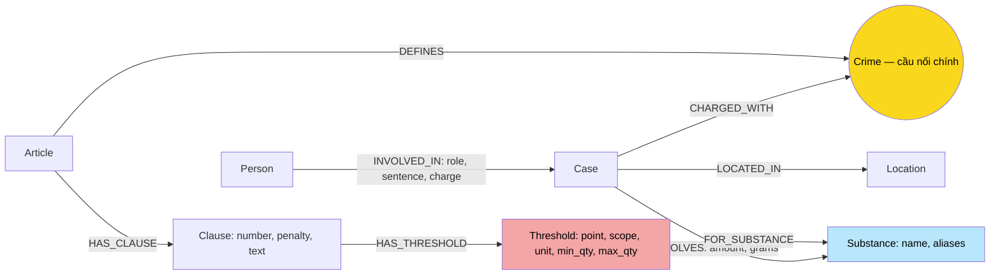

# Thiết kế Ontology — Day 19

**Họ tên:** Ngô Đình Minh Nhật  **MSSV:** 2A202602569

**Lựa chọn:**

- [ ] Dùng ontology gợi ý (có thể chỉnh nhỏ)
- [x] Tự thiết kế (xét bonus +15, xem `SUBMISSION.md`)

Quá trình: dựng và benchmark **ontology gợi ý** trước (kết quả lưu ở `ket_qua_benchmark_kg.hint.txt`), soi lỗi trên graph thật (E3, E5 và giới hạn Q5), rồi đổi ontology để sửa đúng các lỗi đó. Graph và `ket_qua_benchmark_kg.txt` hiện tại được sinh từ ontology tự thiết kế dưới đây (code: `src/graph.py`).

Các nội dung luật được hiểu theo **phiên bản corpus**: BLHS 2015 sửa đổi 2017 và Luật PCMT 2021.

### Những thứ và quan hệ xuất hiện trong hai KB

**★** = xuất hiện trong cả hai KB.

| Thứ / quan hệ | KB luật | KB tin | Biểu diễn |
| --- | --- | --- | --- |
| ★ Tội danh | Tiêu đề Điều "Tội …" | Người bị bắt/truy tố/xử về tội | `Crime`; `Article-DEFINES->Crime`, `Case-CHARGED_WITH->Crime` |
| ★ Chất ma túy | Heroine, MDMA, Methamphetamine… trong các điểm | MDMA, "thuốc lắc", ketamine, etomidate… | `Substance` (tên chuẩn + `aliases`) |
| ★ Khối lượng | Ngưỡng "từ 05 gam đến dưới 30 gam", "100 gam trở lên" | "hơn 9,6kg", "0,686g", "5 viên" | Ngưỡng là node `Threshold {min_qty, max_qty, unit}`; lượng thực tế là `INVOLVES {amount, grams}` |
| ★ Hình phạt | Khung tù của khoản | Mức án cụ thể | `Clause.penalty` vs `INVOLVED_IN.sentence` |
| Điều, khoản, điểm | Cấu trúc đánh số | — | `Article`, `Clause`; **điểm định lượng** thành `Threshold` |
| Người, biệt danh, vụ, nơi | — | Dương Minh Tuấn = Hoàng Nato… | `Person {aliases}`, `Case`, `Location` |

## 1. Sơ đồ



Chu trình `Case → Crime ← Article → Clause → Threshold → Substance ← Case` là cái cho phép **chọn khoản bằng phép so sánh số** (`v.grams >= t.min_qty AND v.grams < t.max_qty`), thay vì để LLM đọc text.

## 2. Entity types (node labels)

| Label | Ý nghĩa | Khóa (`MERGE` theo) | Properties | KB | Trích bằng |
| --- | --- | --- | --- | --- | --- |
| `Article` | Một Điều | `id` = `Điều 251 BLHS` | `id, title, law, doc_id` | Luật | metadata + regex |
| `Clause` | Một khoản | `id` = Article.id + ` khoản N` | `id, number, penalty, text, doc_id` | Luật | regex `CLAUSE_START` |
| `Threshold` | Một **điểm định lượng** của khoản | `id` = Clause.id + ` điểm b` | `id, point, text, scope` (`listed` / `other_solid` / `other_liquid`), `unit` (`g`/`ml`/`cây`), `min_qty, max_qty` (số; `max_qty` null = "trở lên"), `doc_id` | Luật | regex `POINT_START` + `RANGE` / `AT_LEAST`, quy đổi kilôgam → gam |
| `Crime` | Tội danh chuẩn | `name` sau `normalize_crime` | `name, doc_id` | Luật tạo, tin liên kết | tiêu đề luật; tin qua LLM + `link_entity` |
| `Case` | Vụ việc trong tin | `name` | `name, summary, date, doc_id, source_title` | Tin | LLM |
| `Person` | Người tham gia | `name` | `name, aliases, doc_id` | Tin | LLM |
| `Substance` | Chất (tên **chuẩn**) | `name` sau `canonical_substance` | `name, aliases` (cách viết gốc trong tin, vd `thuốc lắc`), `doc_id` | **Cả hai ★** | luật: `find_substances` có ranh giới từ; tin: LLM → `canonical_substance` |
| `Location` | Địa điểm | `name` | `name, doc_id` | Tin | LLM |

**Chống trùng:** unique constraint cho khóa của cả 8 label (`suggested_constraints`). Riêng `Substance`, mọi tên từ tin đi qua `canonical_substance()`: hạ chữ thường → bảng đồng nghĩa (`thuốc lắc→MDMA`, `ma túy đá→Methamphetamine`, `heroin→Heroine`…) → `link_entity(…, SUBSTANCES, normalize=str.lower)` (dùng lại KG-1, fuzzy 0.8) → tên chung chung (`ma túy`, `chất ma túy`, `ma túy tổng hợp`) bị **bỏ**, không tạo node. Cách viết gốc được giữ trong `aliases` để `seed_facts` vẫn khớp khi câu hỏi viết "thuốc lắc".

**Nguồn:** `doc_id` trên mọi node; với node dùng chung (`Crime`, `Substance`, `Person`, `Location`) là tài liệu đầu tiên tạo node (`ON CREATE SET`).

## 3. Relationships

| Type | Từ → Đến | Properties | Ý nghĩa |
| --- | --- | --- | --- |
| `INVOLVED_IN` | `Person → Case` | `role, sentence, charge` | Vai trò, mức án, tội danh **của người đó** |
| `CHARGED_WITH` | `Case → Crime` | — | Vụ liên quan tội danh |
| `INVOLVES` | `Case → Substance` | `amount` (chuỗi gốc), `grams` (số, null nếu không quy được ra gam, vd "5 viên") | Lượng chất trong vụ |
| `LOCATED_IN` | `Case → Location` | — | Địa điểm |
| `DEFINES` | `Article → Crime` | — | Điều định nghĩa tội |
| `HAS_CLAUSE` | `Article → Clause` | — | Khoản thuộc Điều |
| `HAS_THRESHOLD` | `Clause → Threshold` | — | Điểm định lượng thuộc khoản |
| `FOR_SUBSTANCE` | `Threshold → Substance` | — | Ngưỡng áp dụng cho chất này (một điểm liệt kê nhiều chất → nhiều cạnh) |

`MENTIONS` của ontology gợi ý **bị bỏ**: "khoản nhắc chất" được thay bằng `Clause-HAS_THRESHOLD->Threshold-FOR_SUBSTANCE->Substance`, mang thêm ngưỡng số.

## 4. Node cầu nối giữa 2 KB

- **Cầu chính:** `Crime`, qua `(Case)-[:CHARGED_WITH]->(Crime)<-[:DEFINES]-(Article)` (2 cạnh). Tên tội xuất hiện ở cả tiêu đề luật và tin; danh mục tội lấy từ luật được đưa vào prompt, rồi `link_entity` ép về đúng tên chuẩn hoặc `None`.
- **Cầu phụ (định lượng):** `Substance` + `Threshold`. Trong ontology gợi ý, cầu phụ bị **gãy** vì tên chất trùng hoa/thường: `methamphetamine` (tin) không nối tới 18 khoản `MENTIONS Methamphetamine` (luật). Sau chuẩn hóa, 3 vụ có Methamphetamine nối tới 18 Threshold (xem mục 7).
- **Khi cầu gãy:** tội ngoài corpus (vụ An Giang: lái xe sau khi dùng ma túy; vụ Viện Pháp y: nhận hối lộ) không có `CHARGED_WITH` — không ép vào tội gần nhất. Lượng không quy ra gam (`5 viên`) → `grams = null`, khi đó context quay về "mọi khoản có ngưỡng cho chất đó" như cũ.

```cypher
MATCH (k:Case) WHERE NOT EXISTS { MATCH (k)-[:CHARGED_WITH]->() } RETURN k.name, k.doc_id;
-- graph hiện tại: 1 dòng, 'Vụ tông cảnh sát giao thông ở An Giang'
```

## 5. Competency questions

| Câu | Đường đi (Cypher pattern) | Trả lời được? |
| --- | --- | --- |
| Q1 — Tiền chất là gì? | `(a:Article {id:'Điều 2 Luật PCMT'})-[:HAS_CLAUSE]->(cl:Clause {number:4})` | **Có, qua `cl.text`** (nhánh định nghĩa trong `context()`). |
| Q2 — Ai bị tử hình trong vụ 36kg? | `(p:Person)-[r:INVOLVED_IN]->(k:Case {doc_id:'news-100260928173914514'})` lọc `r.sentence` | **Có**: Trần Thanh Tuấn, Trần Minh Tâm. |
| Q3 — Lê Minh Thành: án, tội, Điều, khung cơ bản? | `(p {name:'Lê Minh Thành'})-[r:INVOLVED_IN]->(k)-[:CHARGED_WITH]->(c)<-[:DEFINES]-(a)-[:HAS_CLAUSE]->(cl {number:1})` | **Có**: 36 tháng; Điều 251; 02–07 năm. |
| Q4 — Hoàng Nato: hành vi, tối đa? | như Q3, lọc `'Hoàng Nato' IN p.aliases`, lấy mọi khoản khi hỏi "tối đa" | **Có**: tổ chức sử dụng, Điều 255 khoản 4 (20 năm / chung thân). |
| Q5 — Cái Quang Huy: tội, chất, khoản theo lượng MDMA? | `(p {name:'Cái Quang Huy'})-[:INVOLVED_IN]->(k)-[v:INVOLVES]->(s {name:'MDMA'})`, `(k)-[:CHARGED_WITH]->()<-[:DEFINES]-(a)-[:HAS_CLAUSE]->(cl)-[:HAS_THRESHOLD]->(t)-[:FOR_SUBSTANCE]->(s)` `WHERE v.grams >= t.min_qty AND (t.max_qty IS NULL OR v.grams < t.max_qty)` | **Có, thuần graph** (ontology gợi ý: "một phần, cần LLM đọc text"): 9600 g ≥ 100 g → **Điều 250 khoản 4 điểm b**, tù 20 năm / chung thân / tử hình. |
| Q6 — Những vụ liên quan MDMA? | `(k:Case)-[:INVOLVES]->(:Substance {name:'MDMA'}) RETURN DISTINCT k` | **Có, đầy đủ hơn**: 5 vụ, gồm cả vụ có chữ "thuốc lắc" (alias). Hạn chế: kém chính xác hơn (xem mục 8). |

## 6. Quyết định thiết kế và đánh đổi

1. **Ngưỡng khối lượng là node `Threshold` có số, thay vì để trong `Clause.text`** (gợi ý) hoặc thành property mảng trên Clause. Node riêng cho phép một điểm nối nhiều chất (`FOR_SUBSTANCE`) và so sánh bằng Cypher. Đổi lại thêm 117 node / 339 cạnh và một parser regex phải bảo trì; điểm "02 chất trở lên" (cộng dồn) chưa mô hình hóa.
2. **Substance theo tên chuẩn + `aliases`, thay vì tên thô do LLM viết**. Gộp hoa/thường và đồng nghĩa, bỏ tên chung. Đổi lại phải chấp nhận một quyết định ngữ nghĩa: "thuốc lắc" được coi là MDMA — tăng độ phủ Q6 nhưng có thể dương tính giả.
3. **`INVOLVES.grams` (số) cạnh `amount` (chuỗi gốc)**, thay vì chỉ chuỗi: giữ được sắc thái "hơn", "gần" để trích dẫn, đồng thời có số để so sánh. Lượng tính theo **vụ**, không theo từng người.
4. **Giữ Crime làm cầu chính**: Substance + Threshold chỉ chọn khoản *trong* Điều đã được Crime chọn; chung chất MDMA không đủ để chọn giữa Điều 249/250/251.
5. **Giữ khóa `Case.name`** (như gợi ý): chưa giải được trùng vụ xuyên bài (E3 còn lại, xem `REPORT_KG.md`). Phương án thay thế — gộp Case có chung ≥ 2 Person — bị loại vì sẽ gộp nhầm vụ Viện Pháp y với vụ Sầm Sơn (cùng nhóm người, hai vụ khác nhau).
6. **Retrieval theo loại câu**: câu tổng hợp nhận danh sách vụ đánh số (không kèm text luật), câu theo vụ nhận "khoản áp dụng theo lượng" + khoản 1, câu "tối đa" nhận cả Điều.

## 7. So với ontology gợi ý (bắt buộc nếu xét bonus)

| Điểm khác | Gợi ý làm gì | Bạn làm gì | Vấn đề nó giải quyết | Bằng chứng (Cypher, hoặc số liệu benchmark) |
| --- | --- | --- | --- | --- |
| Ngưỡng khối lượng | `Clause-MENTIONS->Substance`, ngưỡng nằm trong `Clause.text` | Label mới `Threshold {min_qty, max_qty, unit, scope}`, `Clause-HAS_THRESHOLD->Threshold-FOR_SUBSTANCE->Substance`, `INVOLVES.grams` | Q5 trước phải để LLM đọc 4 khoản dài để đoán khoản; nay graph tự chọn khoản. | Cypher Q5 (mục 5) trả `9600.0 g → Điều 250 BLHS, khoản 4, điểm b, min 100 g, "phạt tù 20 năm, tù chung thân hoặc tử hình"` (`report/evidence/bonus_audit.json`, ảnh `kg_my_case.png`). Benchmark: in_tok graph/câu 6783 → **5898** (−13%) vì chỉ đưa khoản áp dụng thay vì mọi khoản nhắc chất. |
| Gộp tên chất | `MERGE (:Substance {name})` theo tên thô | `canonical_substance()`: đồng nghĩa + `link_entity` + bỏ tên chung; `aliases` | E3: trùng `Ketamine/ketamine`, `Methamphetamine/methamphetamine`, node rác `ma túy`, `chất ma túy`; cầu phụ gãy | `MATCH (s:Substance) RETURN count(s)`: **16 → 11** node; không còn cặp hoa/thường hay tên chung. `methamphetamine` (tin) trước nối **0** khoản luật; nay `MATCH (k:Case)-[:INVOLVES]->(:Substance {name:'Methamphetamine'})<-[:FOR_SUBSTANCE]-(t) RETURN count(DISTINCT k), count(DISTINCT t)` = **3 vụ, 18 ngưỡng**. |
| Truy xuất tổng hợp | Context trộn text luật với vụ việc | Danh sách vụ đánh số, có người liên quan, không kèm luật | E5: graph có vụ Viện Pháp y nhưng LLM bỏ sót (cả 2 lần chạy với ontology gợi ý) | Q6 graph: recall **0.67 → 1.00**, judge **1 → 2**. |

**Tổng benchmark** (`ket_qua_benchmark_kg.hint.txt` → `ket_qua_benchmark_kg.txt`, cùng model, cùng câu hỏi): Graph recall **0.94 → 1.00**, judge **1.83 → 2.00**, USD/câu **0.00106 → 0.00094**. Chi phí indexing gần như không đổi (0.00962 → 0.00960) vì Threshold được parse bằng regex, không gọi LLM.

**Competency question ontology gợi ý trả lời thiếu:** Q5 (ở mục 5 bản gợi ý ghi "Một phần bằng graph; so ngưỡng cần đọc text/LLM") nay trả lời được bằng một truy vấn Cypher; Q6 trả lời đủ vụ có chữ "thuốc lắc" mà bản gợi ý bỏ qua do tên chất không khớp.

## 8. Hạn chế còn lại

- **Trùng vụ xuyên bài:** Dương Minh Tuấn vẫn nối 4 node Case từ 4 bài (E3 còn lại).
- **Lỗi trích xuất bị khuếch đại bởi phép so sánh số:** bài Hoàng Nato ghi "khoảng 100g ma túy tổng hợp các loại"; LLM gán thành `Ketamine 100g`, và graph tự suy ra "Điều 251 khoản 3 điểm e" — sai nhưng trông rất chắc chắn.
- **Đồng nghĩa có giá:** `thuốc lắc→MDMA` làm vụ Hoàng Nato xuất hiện trong danh sách MDMA (Q6) dù bài không giám định MDMA.
- **Đơn vị:** "viên", "gói", "đầu pod" không quy ra gam; điểm "02 chất trở lên" (cộng dồn) và ngưỡng theo `cây`, `ml` chưa dùng để so sánh; `1.200g` (phân cách nghìn) sẽ bị đọc là 1,2 g.
- **Lượng theo vụ, không theo người:** Huy 9,6kg và Đạt 4,3kg dùng chung cạnh `INVOLVES` của vụ.
- **Phiên bản luật:** `Article.id` chưa gồm phiên bản văn bản.

### Graph thật (sau `python bench_kg.py --judge`, 05/10/2026)

`MATCH (n) RETURN DISTINCT labels(n)` / `MATCH ()-[r]->() RETURN DISTINCT type(r)`: đúng 8 label và 8 quan hệ ở mục 2–3.

| Label | Số node | Relationship | Số cạnh |
| --- | ---: | --- | ---: |
| Threshold | 117 | FOR_SUBSTANCE | 222 |
| Clause | 99 | HAS_THRESHOLD | 117 |
| Person | 40 | HAS_CLAUSE | 99 |
| Article | 18 | INVOLVED_IN | 48 |
| Case | 14 | CHARGED_WITH | 18 |
| Crime | 13 | INVOLVES | 18 |
| Substance | 11 | LOCATED_IN | 14 |
| Location | 7 | DEFINES | 13 |

Tổng 319 node / 549 cạnh, khớp dòng đầu `ket_qua_benchmark_kg.txt`. Script tái lập: `PYTHONPATH=. python report/evidence/bonus_audit.py` (có kèm self-check các parser).
